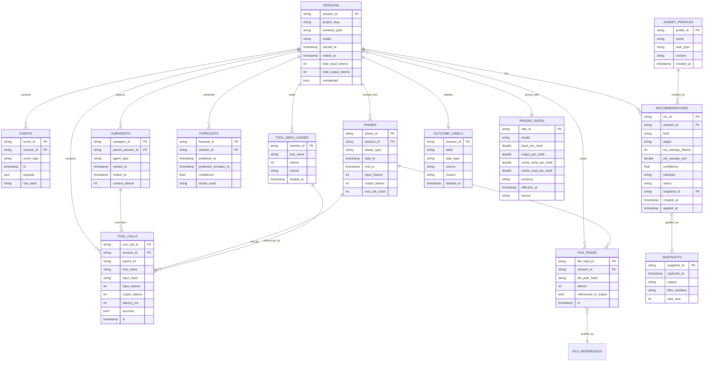

# ccprophet — Data Modeling

**데이터 모델링 문서 (DATAMODELING)**

| 항목 | 내용 |
|---|---|
| 문서 버전 | 0.2 (Sellable MVP Alignment) |
| 작성일 | 2026-04-17 |
| 상위 문서 | `PRD.md` v0.4, `ARCHITECT.md` v0.3, `LAYERING.md` v0.2 |
| 대상 독자 | 컨트리뷰터, 스키마 확장자, 분석 쿼리 작성자 |
| DB 엔진 | DuckDB 1.x |

---

## 1. 문서 목적

본 문서는 `ccprophet`의 DuckDB 스키마, 엔티티 관계, 인덱스 전략, 데이터 수명주기, 핵심 쿼리 패턴을 정의한다. 스키마 변경은 반드시 본 문서 업데이트와 마이그레이션 스크립트를 수반해야 한다.

## 2. 도메인 모델 개요 (Domain Model)

ccprophet의 도메인은 **관측축 6개 + 액션축 5개 = 총 11개** 핵심 엔티티로 구성된다.

*관측축 (v0.2부터 유지)*

| 엔티티 | 설명 | 예시 |
|---|---|---|
| **Session** | Claude Code의 하나의 세션. session_id가 생명주기 단위 | `claude --resume` 전체 |
| **Event** | 세션 내 발생한 원자적 사건. 모든 것의 원본 | tool_use, user_prompt, api_request |
| **ToolCall** | Event의 특화 뷰. tool invocation 전용 | `Read(path=...)`, `Bash(cmd=...)` |
| **ToolDef** | 세션 시작 시 로딩된 tool 정의 | MCP tool 스키마, system tool 스키마 |
| **FileAccess** | 파일 읽기/편집 이벤트 | `Read`, `Edit`, `Write` 결과 |
| **Phase** | 세션 내 논리적 작업 단위 | Planning, Implementation, Review |

*액션축 (v0.4 신설)*

| 엔티티 | 설명 | 예시 |
|---|---|---|
| **Recommendation** | 사용자에게 제안된 최적화 액션. 적용 전/후 상태 추적 | "mcp__github 비활성화 → 1.4k 절감" |
| **Snapshot** | 자동 변경 직전 파일 집합의 아카이브. rollback 단위 | settings.json + .mcp.json |
| **OutcomeLabel** | 세션의 성공/실패 라벨. 수동 또는 규칙 | `success` / `fail` / `partial` |
| **SubsetProfile** | 특정 task type을 위한 MCP/tool 권장 집합 | `refactor.json` |
| **PricingRate** | 모델별 요율 스냅샷. Cost 재계산 감사용 | Opus input $15/M, output $75/M |

**핵심 파생 개념**

- **Bloat**: `ToolDef`가 있지만 대응되는 `ToolCall`이 없는 상태. 또는 `FileAccess`가 있지만 assistant output에서 참조되지 않은 상태.
- **Reference**: tool_use 블록 또는 assistant message에서 특정 tool/file이 실제로 호출·언급됨.
- **Realized Savings**: `Recommendation`이 apply된 뒤 세션의 실측 cost 감소액.
- **Estimated Savings**: apply 전 예측 cost 감소액. 반드시 realized와 다른 라벨.
- **Best Config**: 같은 `TaskType` 성공 라벨 세션 클러스터의 공통 MCP/tool/phase 구성.

## 3. ER 다이어그램 (Entity Relationship)



## 4. 테이블 상세 (Table Specifications)

### 4.1 `sessions`

세션 단위 요약 정보. 다른 모든 테이블이 이 테이블을 참조한다.

```sql
CREATE TABLE sessions (
    session_id          VARCHAR PRIMARY KEY,
    project_slug        VARCHAR NOT NULL,
    worktree_path_hash  VARCHAR,               -- SHA256(worktree_path)
    worktree_path       VARCHAR,               -- redaction OFF일 때만
    model               VARCHAR NOT NULL,      -- 'claude-opus-4-6' 등
    started_at          TIMESTAMP NOT NULL,
    ended_at            TIMESTAMP,             -- NULL이면 active
    total_input_tokens  INTEGER DEFAULT 0,
    total_output_tokens INTEGER DEFAULT 0,
    compacted           BOOLEAN DEFAULT FALSE, -- autocompact 발생 여부
    compacted_at        TIMESTAMP,
    context_window_size INTEGER DEFAULT 200000,
    created_at          TIMESTAMP DEFAULT now(),
    schema_version      INTEGER DEFAULT 1
);

CREATE INDEX idx_sessions_project ON sessions(project_slug);
CREATE INDEX idx_sessions_started ON sessions(started_at DESC);
CREATE INDEX idx_sessions_compacted ON sessions(compacted) WHERE compacted = TRUE;
```

**설계 결정**
- `session_id`는 Claude Code가 생성하는 UUID를 그대로 사용. 자체 생성 안 함.
- `worktree_path_hash`는 항상 기록, 원본은 redaction 설정에 따라 optional.
- `total_*_tokens`는 비정규화된 합계. 매 훅마다 incremental update. 검증용으로 별도 집계 쿼리와 대조.
- `compacted` 플래그는 forecaster 학습·평가의 ground truth.

### 4.2 `events`

모든 이벤트의 원본 저장소. append-only. 분석용 특화 테이블들이 여기서 파생된다.

```sql
CREATE TABLE events (
    event_id       VARCHAR PRIMARY KEY,       -- UUID or {session_id}:{seq}
    session_id     VARCHAR NOT NULL,
    event_type     VARCHAR NOT NULL,          -- 'PostToolUse', 'UserPromptSubmit' 등
    ts             TIMESTAMP NOT NULL,
    payload        JSON NOT NULL,             -- redacted
    raw_hash       VARCHAR NOT NULL,          -- SHA256(원본 JSON) — dedup용
    ingested_at    TIMESTAMP DEFAULT now(),
    ingested_via   VARCHAR NOT NULL,          -- 'hook' | 'jsonl' | 'otlp'

    FOREIGN KEY (session_id) REFERENCES sessions(session_id)
);

CREATE INDEX idx_events_session_ts ON events(session_id, ts);
CREATE INDEX idx_events_type ON events(event_type);
CREATE UNIQUE INDEX idx_events_dedup ON events(raw_hash);
```

**설계 결정**
- `payload`는 JSON 타입. DuckDB의 JSON 함수로 쿼리 가능 (`json_extract_string`).
- `raw_hash`로 중복 방지 — 여러 ingestion 경로(hook, jsonl, otlp)가 동일 이벤트 보내도 UNIQUE INDEX가 막음.
- 전체 payload를 유지하는 이유: 스키마 확장 시 재분석 가능하도록.

**주요 event_type 목록**
- `UserPromptSubmit` — 사용자 입력
- `PreToolUse` — tool 호출 직전
- `PostToolUse` — tool 호출 완료
- `SubagentStart`, `SubagentStop` — 서브에이전트 생명주기
- `Stop` — 세션 종료
- `CompactTriggered` — autocompact 발생
- `ContextSnapshot` — `/context` 명령 결과 (주기적 수집)

### 4.3 `tool_calls`

`events` 중 tool invocation을 정규화한 테이블. PostToolUse 이벤트에서 파생.

```sql
CREATE TABLE tool_calls (
    tool_call_id    VARCHAR PRIMARY KEY,
    session_id      VARCHAR NOT NULL,
    parent_id       VARCHAR,                 -- Subagent인 경우 부모 session
    tool_name       VARCHAR NOT NULL,
    input_hash      VARCHAR NOT NULL,
    input_tokens    INTEGER,
    output_tokens   INTEGER,
    latency_ms      INTEGER,
    success         BOOLEAN DEFAULT TRUE,
    error_type      VARCHAR,
    ts              TIMESTAMP NOT NULL,
    phase_id        VARCHAR,                 -- phase detection 결과

    FOREIGN KEY (session_id) REFERENCES sessions(session_id),
    FOREIGN KEY (phase_id) REFERENCES phases(phase_id)
);

CREATE INDEX idx_tc_session ON tool_calls(session_id);
CREATE INDEX idx_tc_tool_name ON tool_calls(tool_name);
CREATE INDEX idx_tc_ts ON tool_calls(ts);
CREATE INDEX idx_tc_phase ON tool_calls(phase_id);
```

**설계 결정**
- `input_hash`: tool input 직렬화의 SHA256. 동일 입력 반복 호출 탐지용.
- `parent_id`: 서브에이전트가 부모를 추적. NULL이면 메인 세션.
- `phase_id`: phase detection이 실행된 뒤 채워짐. 최초 insert 시에는 NULL.

### 4.4 `tool_defs_loaded`

세션 시작 시점에 로딩된 tool 정의. Bloat 분석의 핵심.

```sql
CREATE TABLE tool_defs_loaded (
    session_id    VARCHAR NOT NULL,
    tool_name     VARCHAR NOT NULL,
    tokens        INTEGER NOT NULL,
    source        VARCHAR NOT NULL,     -- 'system' | 'mcp:<server>' | 'custom_agent' | 'skill'
    loaded_at     TIMESTAMP NOT NULL,

    PRIMARY KEY (session_id, tool_name),
    FOREIGN KEY (session_id) REFERENCES sessions(session_id)
);

CREATE INDEX idx_tdl_source ON tool_defs_loaded(source);
```

**설계 결정**
- Composite PK (session_id, tool_name) — 세션당 tool은 1회 로딩.
- `tokens`는 Claude Code의 `/context` 출력 또는 추정값. 추정 방식은 별도 휴리스틱 문서 참조.
- `source` 필드로 bloat 원인을 추적 가능 ("어느 MCP 서버가 가장 bloat한가").

### 4.5 `file_reads`

파일 읽기 이벤트. "Loaded vs Referenced" 분석 중 파일 축을 담당.

```sql
CREATE TABLE file_reads (
    file_read_id           VARCHAR PRIMARY KEY,
    session_id             VARCHAR NOT NULL,
    file_path_hash         VARCHAR NOT NULL,
    file_path              VARCHAR,          -- redaction OFF일 때만
    tokens                 INTEGER NOT NULL,
    referenced_in_output   BOOLEAN DEFAULT FALSE,
    referenced_at          TIMESTAMP,
    ts                     TIMESTAMP NOT NULL,

    FOREIGN KEY (session_id) REFERENCES sessions(session_id)
);

CREATE INDEX idx_fr_session ON file_reads(session_id);
CREATE INDEX idx_fr_hash ON file_reads(file_path_hash);
CREATE INDEX idx_fr_referenced ON file_reads(referenced_in_output);
```

**`referenced_in_output` 판정 로직**
- assistant message의 텍스트에 파일 경로 문자열이 등장 → 참조됨
- 후속 `Edit` tool_call의 file_path가 동일 → 참조됨
- 세션 종료 시 배치 업데이트

### 4.6 `phases`

세션을 논리적 단위로 분할. Phase detection 알고리즘의 결과물.

```sql
CREATE TABLE phases (
    phase_id          VARCHAR PRIMARY KEY,
    session_id        VARCHAR NOT NULL,
    phase_type        VARCHAR NOT NULL,     -- 'planning' | 'implementation' | 'debugging' | 'review' | 'unknown'
    start_ts          TIMESTAMP NOT NULL,
    end_ts            TIMESTAMP,
    input_tokens      INTEGER DEFAULT 0,
    output_tokens     INTEGER DEFAULT 0,
    tool_call_count   INTEGER DEFAULT 0,
    detection_confidence FLOAT,

    FOREIGN KEY (session_id) REFERENCES sessions(session_id)
);

CREATE INDEX idx_phases_session ON phases(session_id, start_ts);
CREATE INDEX idx_phases_type ON phases(phase_type);
```

**Phase 타입 정의**

| phase_type | 판정 기준 (휴리스틱) |
|---|---|
| `planning` | Task tool 호출 전 구간, 또는 `/plan` 명령 후 첫 번째 Edit 전까지 |
| `implementation` | Edit/Write tool 비율이 전체의 30% 이상인 구간 |
| `debugging` | 같은 파일 2회 이상 re-read + Bash 호출 포함 구간 |
| `review` | Read 비율 높고 Edit 없는 말미 구간 |
| `unknown` | 위 규칙 매치 안 되는 구간 (detection_confidence 낮음) |

Phase detection 로직의 상세는 `docs/phase_detection.md`에서 별도 관리.

### 4.7 `forecasts`

예측 결과의 시계열 기록. Forecaster 성능 평가용.

```sql
CREATE TABLE forecasts (
    forecast_id             VARCHAR PRIMARY KEY,
    session_id              VARCHAR NOT NULL,
    predicted_at            TIMESTAMP NOT NULL,
    predicted_compact_at    TIMESTAMP,           -- NULL이면 "no compact expected"
    confidence              FLOAT,               -- 0.0 ~ 1.0
    model_used              VARCHAR NOT NULL,    -- 'linear_v1' | 'arima_v2' 등
    input_token_rate        FLOAT,               -- tokens/sec at predicted_at
    context_usage_at_pred   FLOAT,               -- 0.0 ~ 1.0

    FOREIGN KEY (session_id) REFERENCES sessions(session_id)
);

CREATE INDEX idx_forecasts_session_pred ON forecasts(session_id, predicted_at);
```

**활용**
- 예측 정확도 MAE 계산: `actual_compacted_at - predicted_compact_at`
- 모델 A/B 비교: 같은 session에 대해 다른 `model_used` 예측 저장
- 장기 학습 데이터셋 구축

### 4.8 `subagents`

Subagent 생명주기 추적.

```sql
CREATE TABLE subagents (
    subagent_id         VARCHAR PRIMARY KEY,
    parent_session_id   VARCHAR NOT NULL,
    agent_type          VARCHAR,              -- 'Task' | custom agent 이름
    started_at          TIMESTAMP NOT NULL,
    ended_at            TIMESTAMP,
    context_tokens      INTEGER DEFAULT 0,
    tool_call_count     INTEGER DEFAULT 0,
    returned_summary    VARCHAR,              -- redaction 허용 시에만

    FOREIGN KEY (parent_session_id) REFERENCES sessions(session_id)
);

CREATE INDEX idx_subagents_parent ON subagents(parent_session_id);
```

### 4.9 `prophet_self_metrics`

ccprophet 자신의 운영 메트릭. Dogfooding.

```sql
CREATE TABLE prophet_self_metrics (
    metric_id        VARCHAR PRIMARY KEY,
    ts               TIMESTAMP NOT NULL,
    metric_name      VARCHAR NOT NULL,    -- 'hook_latency_ms', 'ingest_lag_sec' 등
    value            DOUBLE NOT NULL,
    labels           JSON                 -- {"event_type": "PostToolUse"} 등
);

CREATE INDEX idx_psm_name_ts ON prophet_self_metrics(metric_name, ts DESC);
```

### 4.10 `schema_migrations`

스키마 버전 관리.

```sql
CREATE TABLE schema_migrations (
    version       INTEGER PRIMARY KEY,
    applied_at    TIMESTAMP NOT NULL,
    description   VARCHAR NOT NULL
);
```

### 4.11 `recommendations`

Recommender가 생성한 모든 제안의 로그. pending / applied / dismissed / expired 상태 전이.

```sql
CREATE TABLE recommendations (
    rec_id              VARCHAR PRIMARY KEY,
    session_id          VARCHAR NOT NULL,
    kind                VARCHAR NOT NULL,  -- 'prune_mcp' | 'prune_tool' | 'run_clear'
                                           -- | 'switch_subset' | 'compact_focus'
                                           -- | 'reproduce_config'
    target              VARCHAR,           -- MCP 이름, tool 이름, subset name 등
    est_savings_tokens  INTEGER DEFAULT 0,
    est_savings_usd     DOUBLE DEFAULT 0,
    confidence          FLOAT NOT NULL,    -- 0.0 ~ 1.0
    rationale           VARCHAR NOT NULL,  -- "최근 30일 0회 사용, 절감 1.4k 토큰" 등
    status              VARCHAR NOT NULL DEFAULT 'pending',
                                           -- 'pending' | 'applied' | 'dismissed' | 'expired'
    snapshot_id         VARCHAR,           -- applied된 경우 어떤 snapshot에 담겼는지
    provenance          VARCHAR,           -- 'recommend' | 'reproduce:<task>' | 'budget:<task>'
    created_at          TIMESTAMP NOT NULL,
    applied_at          TIMESTAMP,
    dismissed_at        TIMESTAMP,

    FOREIGN KEY (session_id) REFERENCES sessions(session_id),
    FOREIGN KEY (snapshot_id) REFERENCES snapshots(snapshot_id)
);

CREATE INDEX idx_rec_session ON recommendations(session_id, created_at DESC);
CREATE INDEX idx_rec_status ON recommendations(status, created_at DESC);
CREATE INDEX idx_rec_kind ON recommendations(kind);
```

**설계 결정**
- `rationale`은 사용자에게 노출되는 "왜" 설명. NFR-10 (설명 가능성) 준수.
- `status` 전이는 단방향만 허용 (applied → dismissed 불가, rollback은 새 rec으로).
- `provenance`로 추천의 출처(자동 탐지 vs reproduce vs budget) 구분.

### 4.12 `snapshots`

Auto-Fix로 수정된 파일의 **메타데이터**. 실제 파일 바이트는 `~/.claude-prophet/snapshots/<id>/` 에 저장.

```sql
CREATE TABLE snapshots (
    snapshot_id      VARCHAR PRIMARY KEY,
    captured_at      TIMESTAMP NOT NULL,
    reason           VARCHAR NOT NULL,     -- 'prune-<timestamp>' 등
    triggered_by     VARCHAR,              -- 'apply_pruning' | 'apply_reproduce'
    files_manifest   JSON NOT NULL,        -- [{"path": "...", "sha256": "...", "bytes": N}, ...]
    byte_size        INTEGER DEFAULT 0,    -- 총 아카이브 크기
    restored_at      TIMESTAMP             -- restore 수행 시 기록
);

CREATE INDEX idx_snapshot_captured ON snapshots(captured_at DESC);
```

**설계 결정**
- 원본 파일은 FS에 저장, DB에는 manifest만. DuckDB가 대용량 BLOB을 잘 다루지만 파일 접근성(개별 restore, 사용자 편집)을 위해 FS 분리.
- `restored_at`은 단일 칸 — 같은 snapshot을 두 번 restore하면 timestamp만 업데이트.

### 4.13 `outcome_labels`

세션별 성공/실패 라벨. 세션당 최대 1개. `task_type`은 budget·reproduce의 검색 키.

```sql
CREATE TABLE outcome_labels (
    session_id     VARCHAR PRIMARY KEY,
    label          VARCHAR NOT NULL,      -- 'success' | 'fail' | 'partial'
    task_type      VARCHAR,               -- 'refactor-auth', 'bugfix', 'new-feature' 등 자유 문자열
    source         VARCHAR NOT NULL,      -- 'manual' | 'rule:<name>' | 'auto'
    reason         VARCHAR,               -- 라벨 근거 1줄
    labeled_at     TIMESTAMP NOT NULL,

    FOREIGN KEY (session_id) REFERENCES sessions(session_id)
);

CREATE INDEX idx_outcome_label ON outcome_labels(label, task_type);
CREATE INDEX idx_outcome_task ON outcome_labels(task_type);
```

**설계 결정**
- 세션에 컬럼을 추가(`sessions.outcome_label`)하는 안도 고려했으나, 라벨 변경 이력·source 추적이 필요해 별도 테이블.
- 변경 이력은 MVP에서는 단일 행 덮어쓰기. Phase 3에서 `outcome_label_history`로 확장 여지.

### 4.14 `subset_profiles`

작업 유형별 권장 MCP/tool subset. `~/.claude-prophet/profiles/*.json` 파일의 DB 인덱스.

```sql
CREATE TABLE subset_profiles (
    profile_id     VARCHAR PRIMARY KEY,
    name           VARCHAR NOT NULL UNIQUE,    -- 'refactor', 'review' 등
    task_type      VARCHAR,                    -- 연결된 task_type (optional)
    content        JSON NOT NULL,              -- {"enabled_tools": [...], "disabled_mcps": [...]}
    derived_from   VARCHAR,                    -- 'manual' | 'best_config:<task>:<date>'
    created_at     TIMESTAMP NOT NULL,
    updated_at     TIMESTAMP
);

CREATE INDEX idx_profile_task ON subset_profiles(task_type);
```

### 4.15 `pricing_rates`

모델별 요율의 **이력 + 감사**. 세션 cost 재계산 시 "당시 어떤 요율을 썼는지" 역추적.

```sql
CREATE TABLE pricing_rates (
    rate_id                 VARCHAR PRIMARY KEY,
    model                   VARCHAR NOT NULL,
    input_per_mtok          DOUBLE NOT NULL,
    output_per_mtok         DOUBLE NOT NULL,
    cache_write_per_mtok    DOUBLE DEFAULT 0,
    cache_read_per_mtok     DOUBLE DEFAULT 0,
    currency                VARCHAR NOT NULL DEFAULT 'USD',
    effective_at            TIMESTAMP NOT NULL,
    source                  VARCHAR NOT NULL   -- 'bundled' | 'user_override'
);

CREATE INDEX idx_pricing_model_eff ON pricing_rates(model, effective_at DESC);
```

**설계 결정**
- 요율표 업데이트는 `INSERT`로 이력 쌓기. 과거 세션의 cost 계산은 `effective_at <= session.started_at` 중 가장 최근 행 사용.
- `source='bundled'`은 패키지 업그레이드로 자동 seed, `user_override`는 `pricing.toml`에서 import.

## 5. 인덱스 전략 (Indexing)

### 5.1 원칙

- **OLAP 워크로드**: 분석 쿼리가 주류. 인덱스 과다 생성보다 DuckDB 스캔 성능 신뢰.
- **세션 필터**: 거의 모든 쿼리가 `WHERE session_id = ?` 포함. 관련 테이블에 필수.
- **시간 범위**: `ts DESC` 인덱스로 최근 데이터 우선 조회 최적화.
- **dedup**: `events.raw_hash`의 UNIQUE 인덱스로 중복 삽입 방지.

### 5.2 인덱스 목록 (종합)

```sql
-- sessions
CREATE INDEX idx_sessions_project ON sessions(project_slug);
CREATE INDEX idx_sessions_started ON sessions(started_at DESC);
CREATE INDEX idx_sessions_compacted ON sessions(compacted) WHERE compacted = TRUE;

-- events
CREATE INDEX idx_events_session_ts ON events(session_id, ts);
CREATE INDEX idx_events_type ON events(event_type);
CREATE UNIQUE INDEX idx_events_dedup ON events(raw_hash);

-- tool_calls
CREATE INDEX idx_tc_session ON tool_calls(session_id);
CREATE INDEX idx_tc_tool_name ON tool_calls(tool_name);
CREATE INDEX idx_tc_ts ON tool_calls(ts);
CREATE INDEX idx_tc_phase ON tool_calls(phase_id);

-- tool_defs_loaded
CREATE INDEX idx_tdl_source ON tool_defs_loaded(source);

-- file_reads
CREATE INDEX idx_fr_session ON file_reads(session_id);
CREATE INDEX idx_fr_hash ON file_reads(file_path_hash);
CREATE INDEX idx_fr_referenced ON file_reads(referenced_in_output);

-- phases
CREATE INDEX idx_phases_session ON phases(session_id, start_ts);
CREATE INDEX idx_phases_type ON phases(phase_type);

-- forecasts
CREATE INDEX idx_forecasts_session_pred ON forecasts(session_id, predicted_at);

-- subagents
CREATE INDEX idx_subagents_parent ON subagents(parent_session_id);

-- self metrics
CREATE INDEX idx_psm_name_ts ON prophet_self_metrics(metric_name, ts DESC);

-- recommendations / snapshots / outcomes / profiles / pricing (v0.4)
CREATE INDEX idx_rec_session ON recommendations(session_id, created_at DESC);
CREATE INDEX idx_rec_status ON recommendations(status, created_at DESC);
CREATE INDEX idx_rec_kind ON recommendations(kind);
CREATE INDEX idx_snapshot_captured ON snapshots(captured_at DESC);
CREATE INDEX idx_outcome_label ON outcome_labels(label, task_type);
CREATE INDEX idx_outcome_task ON outcome_labels(task_type);
CREATE INDEX idx_profile_task ON subset_profiles(task_type);
CREATE INDEX idx_pricing_model_eff ON pricing_rates(model, effective_at DESC);
```

## 6. 데이터 수명주기 (Data Lifecycle)

```
┌───────────────────┐
│  Raw JSONL / Hook │
│  (~/.claude/...) │
└─────────┬─────────┘
          │ ingest (append-only)
          ▼
┌───────────────────┐
│     events        │  ← 모든 원본, 90일 보관
└─────────┬─────────┘
          │ normalize (real-time trigger)
          ▼
┌───────────────────────────────────────────────┐
│  tool_calls | tool_defs_loaded | file_reads   │  ← 정규화, 90일 보관
│  subagents  | phases (detection 후)           │
└─────────┬─────────────────────────────────────┘
          │ aggregate (daily batch or on-demand)
          ▼
┌───────────────────┐
│  forecasts        │  ← 예측 시계열, 180일 보관
│  session_summary  │  ← 일별 roll-up view
└─────────┬─────────┘
          │ archive (90일 후)
          ▼
┌───────────────────┐
│  Parquet files    │  ← ~/.claude-prophet/archive/YYYY-MM-DD.parquet
│  (장기 보관)      │
└───────────────────┘
```

### 6.1 보관 정책

| 테이블 | 핫 (DuckDB) | 웜 (Parquet) | 삭제 |
|---|---|---|---|
| events | 90일 | 1년 | 1년 후 |
| tool_calls | 90일 | 1년 | 1년 후 |
| tool_defs_loaded | 90일 | 1년 | 1년 후 |
| file_reads | 90일 | 1년 | 1년 후 |
| phases | 90일 | 1년 | 1년 후 |
| forecasts | 180일 | 영구 | 없음 (모델 학습용) |
| sessions | 영구 | - | 사용자가 명시적으로 요청 시 |
| prophet_self_metrics | 30일 | - | 30일 후 |

### 6.2 Roll-up 집계 (V5 / `ccprophet rollup`)

90일 넘은 세션은 상세 이벤트 대신 `session_summary` 요약 테이블만 유지. V5 마이그레이션으로 추가됐고 `ccprophet rollup` CLI가 운영한다.

```sql
CREATE TABLE session_summary (
    session_id              VARCHAR PRIMARY KEY,
    project_slug            VARCHAR NOT NULL,
    model                   VARCHAR NOT NULL,
    started_at              TIMESTAMP NOT NULL,
    ended_at                TIMESTAMP,
    total_input_tokens      INTEGER DEFAULT 0,
    total_output_tokens     INTEGER DEFAULT 0,
    total_cache_creation_tokens INTEGER DEFAULT 0,
    total_cache_read_tokens INTEGER DEFAULT 0,
    compacted               BOOLEAN DEFAULT FALSE,
    tool_call_count         INTEGER DEFAULT 0,
    unique_tools_used       INTEGER DEFAULT 0,
    loaded_tool_def_tokens  INTEGER DEFAULT 0,
    bloat_tokens            INTEGER DEFAULT 0,
    bloat_ratio             DOUBLE DEFAULT 0.0,
    file_read_count         INTEGER DEFAULT 0,
    phase_count             INTEGER DEFAULT 0,
    summarized_at           TIMESTAMP NOT NULL,
    source_rows_deleted     BOOLEAN DEFAULT FALSE
);
```

**CLI 인터페이스**

```bash
# Dry-run: 무엇이 summarize되고 얼마나 삭제될지 미리 본다
ccprophet rollup --older-than 90d

# 실제 요약 + 상세 행 삭제
ccprophet rollup --older-than 90d --apply

# 삭제 전에 Parquet 아카이브
ccprophet rollup --older-than 90d --apply --archive-parquet ~/.claude-prophet/archive/2026-04/
```

**운영 순서**
1. `SessionAggregator` (도메인 서비스)가 각 세션에 대해 `tool_calls`/`tool_defs_loaded`/`phases`/`file_reads`/`BloatReport`를 집계해 `SessionSummary`를 만든다.
2. `SessionSummaryRepository.upsert`로 요약 저장.
3. `--apply`인 경우 `HotTablePruner.delete_for_sessions`가 `events`, `tool_calls`, `tool_defs_loaded`, `file_reads`, `phases`에서 해당 `session_id` 행을 DELETE. 삭제 수를 `PruneCounts`로 리턴.
4. `source_rows_deleted` 플래그를 TRUE로 업데이트 — 감사 추적용.

`sessions` 테이블은 건드리지 않는다 (§6.1 영구 보관). 요약이 생기면 이후 분석 쿼리는 요약+sessions JOIN으로 수행.

### 6.3 아카이브 스크립트 (일별 실행)

```sql
-- 매일 새벽 자동 실행
COPY (SELECT * FROM events WHERE ts < NOW() - INTERVAL 90 DAY)
TO '~/.claude-prophet/archive/events-2026-01-15.parquet' (FORMAT PARQUET);

DELETE FROM events WHERE ts < NOW() - INTERVAL 90 DAY;
```

## 7. 핵심 쿼리 패턴 (Core Query Patterns)

각 PRD 기능에 대응하는 대표 쿼리.

### 7.1 F3 `ccprophet bloat` — Loaded vs Referenced

```sql
-- 현재 세션의 bloat 리포트
WITH current_session AS (
    SELECT session_id FROM sessions
    WHERE ended_at IS NULL
    ORDER BY started_at DESC LIMIT 1
),
loaded AS (
    SELECT tool_name, tokens, source
    FROM tool_defs_loaded
    WHERE session_id = (SELECT session_id FROM current_session)
),
called AS (
    SELECT DISTINCT tool_name
    FROM tool_calls
    WHERE session_id = (SELECT session_id FROM current_session)
)
SELECT
    l.source,
    l.tool_name,
    l.tokens,
    CASE WHEN c.tool_name IS NULL THEN 'BLOAT' ELSE 'USED' END AS status
FROM loaded l
LEFT JOIN called c ON l.tool_name = c.tool_name
ORDER BY l.tokens DESC;
```

**집계 버전**
```sql
SELECT
    source,
    SUM(CASE WHEN c.tool_name IS NULL THEN tokens ELSE 0 END) AS bloat_tokens,
    SUM(tokens) AS total_tokens,
    ROUND(
        100.0 * SUM(CASE WHEN c.tool_name IS NULL THEN tokens ELSE 0 END) / SUM(tokens),
        1
    ) AS bloat_pct
FROM tool_defs_loaded l
LEFT JOIN (SELECT DISTINCT session_id, tool_name FROM tool_calls) c
    ON l.session_id = c.session_id AND l.tool_name = c.tool_name
WHERE l.session_id = ?
GROUP BY source
ORDER BY bloat_tokens DESC;
```

### 7.2 F3 `ccprophet phase` — 페이즈별 breakdown

```sql
SELECT
    phase_type,
    COUNT(*) AS phase_count,
    SUM(input_tokens) AS total_input,
    SUM(output_tokens) AS total_output,
    SUM(tool_call_count) AS total_tools,
    ROUND(AVG(EXTRACT(EPOCH FROM (end_ts - start_ts))), 1) AS avg_duration_sec
FROM phases
WHERE session_id = ?
GROUP BY phase_type
ORDER BY total_input DESC;
```

### 7.3 F3 `ccprophet diff` — 세션 비교

```sql
-- 두 세션의 효율성 지표 비교
WITH session_stats AS (
    SELECT
        s.session_id,
        s.total_input_tokens,
        s.total_output_tokens,
        COUNT(DISTINCT tc.tool_call_id) AS tool_calls,
        AVG(tc.latency_ms) AS avg_latency,
        SUM(CASE WHEN fr.referenced_in_output THEN fr.tokens ELSE 0 END)::FLOAT
            / NULLIF(SUM(fr.tokens), 0) AS file_utilization,
        s.compacted
    FROM sessions s
    LEFT JOIN tool_calls tc ON tc.session_id = s.session_id
    LEFT JOIN file_reads fr ON fr.session_id = s.session_id
    WHERE s.session_id IN (?, ?)
    GROUP BY s.session_id, s.total_input_tokens, s.total_output_tokens, s.compacted
)
SELECT * FROM session_stats;
```

### 7.4 F5 Forecasting — 예측 입력 데이터

```sql
-- 최근 5분 burn rate
SELECT
    tool_name,
    COUNT(*) AS call_count,
    SUM(input_tokens) AS total_input,
    SUM(input_tokens)::FLOAT / 300 AS tokens_per_sec
FROM tool_calls
WHERE session_id = ?
  AND ts >= NOW() - INTERVAL 5 MINUTE
GROUP BY tool_name
ORDER BY total_input DESC;
```

```sql
-- 컨텍스트 사용률 시계열 (forecaster 입력)
SELECT
    ts,
    json_extract(payload, '$.context_usage.total') AS context_used,
    json_extract(payload, '$.context_usage.max') AS context_max
FROM events
WHERE session_id = ?
  AND event_type = 'ContextSnapshot'
ORDER BY ts;
```

### 7.5 F6 MCP `get_current_bloat()` — 실시간 쿼리

위 7.1 쿼리의 집계 버전을 그대로 사용. MCP server가 이 결과를 JSON으로 직렬화.

### 7.6 Cross-worktree 집계

```sql
-- 모든 worktree 합산, 최근 7일
SELECT
    worktree_path_hash,
    project_slug,
    COUNT(*) AS session_count,
    SUM(total_input_tokens) AS total_tokens,
    SUM(CASE WHEN compacted THEN 1 ELSE 0 END) AS compact_events,
    ROUND(AVG(total_input_tokens), 0) AS avg_tokens_per_session
FROM sessions
WHERE started_at >= NOW() - INTERVAL 7 DAY
GROUP BY worktree_path_hash, project_slug
ORDER BY total_tokens DESC;
```

### 7.7 F7 `ccprophet recommend` — 추천 목록 조회

```sql
-- 현재 세션의 pending 추천 (우선순위 순)
SELECT
    r.rec_id,
    r.kind,
    r.target,
    r.est_savings_tokens,
    r.est_savings_usd,
    r.confidence,
    r.rationale
FROM recommendations r
WHERE r.session_id = ?
  AND r.status = 'pending'
ORDER BY r.est_savings_usd DESC, r.confidence DESC
LIMIT 10;
```

### 7.8 F10 `ccprophet cost` — 월별 cost 요약

```sql
-- 월별 세션 cost + 실측 절약액
WITH session_costs AS (
    SELECT
        s.session_id,
        s.model,
        s.started_at,
        s.total_input_tokens,
        s.total_output_tokens,
        (s.total_input_tokens / 1e6) * pr.input_per_mtok
            + (s.total_output_tokens / 1e6) * pr.output_per_mtok AS session_cost_usd
    FROM sessions s
    JOIN pricing_rates pr ON pr.model = s.model
        AND pr.effective_at <= s.started_at
    WHERE DATE_TRUNC('month', s.started_at) = DATE ?
    QUALIFY ROW_NUMBER() OVER (
        PARTITION BY s.session_id
        ORDER BY pr.effective_at DESC
    ) = 1
)
SELECT
    COUNT(*) AS sessions,
    SUM(session_cost_usd) AS total_cost_usd,
    AVG(session_cost_usd) AS avg_session_cost_usd
FROM session_costs;
```

```sql
-- 실측 절약액: apply된 추천의 est_savings_usd 합
SELECT
    DATE_TRUNC('month', applied_at) AS month,
    SUM(est_savings_usd) AS realized_savings_usd,
    COUNT(*) AS applied_recommendations
FROM recommendations
WHERE status = 'applied'
  AND applied_at >= DATE_TRUNC('month', NOW()) - INTERVAL 12 MONTH
GROUP BY 1
ORDER BY 1;
```

### 7.9 F11 `ccprophet reproduce` — best config 추출

```sql
-- 작업 유형별 성공 세션 클러스터의 공통 tool 집합 (n≥3일 때만)
WITH success_sessions AS (
    SELECT s.session_id
    FROM sessions s
    JOIN outcome_labels ol ON ol.session_id = s.session_id
    WHERE ol.label = 'success'
      AND ol.task_type = ?
),
tool_usage AS (
    SELECT
        tc.tool_name,
        COUNT(DISTINCT tc.session_id) AS sessions_using,
        SUM(1) AS total_calls
    FROM tool_calls tc
    WHERE tc.session_id IN (SELECT session_id FROM success_sessions)
    GROUP BY tc.tool_name
)
SELECT
    tool_name,
    sessions_using,
    total_calls,
    (SELECT COUNT(*) FROM success_sessions) AS cluster_size
FROM tool_usage
WHERE (SELECT COUNT(*) FROM success_sessions) >= 3
  AND sessions_using * 1.0 / (SELECT COUNT(*) FROM success_sessions) >= 0.6
ORDER BY sessions_using DESC, total_calls DESC;
```

### 7.10 F11 `ccprophet postmortem` — 실패 세션과 유사 성공 세션 Δ

```sql
-- 대상 실패 세션과 동일 task_type의 성공 세션 tool 빈도 차이
WITH target AS (
    SELECT session_id, task_type
    FROM outcome_labels
    WHERE session_id = ?
),
target_tools AS (
    SELECT tool_name, COUNT(*) AS cnt
    FROM tool_calls
    WHERE session_id = (SELECT session_id FROM target)
    GROUP BY tool_name
),
success_tools AS (
    SELECT tc.tool_name, AVG(freq) AS avg_freq
    FROM (
        SELECT ol.session_id, tc.tool_name, COUNT(*) AS freq
        FROM outcome_labels ol
        JOIN tool_calls tc ON tc.session_id = ol.session_id
        WHERE ol.label = 'success'
          AND ol.task_type = (SELECT task_type FROM target)
          AND ol.session_id != (SELECT session_id FROM target)
        GROUP BY ol.session_id, tc.tool_name
    ) tc
    GROUP BY tc.tool_name
)
SELECT
    COALESCE(t.tool_name, s.tool_name) AS tool_name,
    COALESCE(t.cnt, 0) AS target_calls,
    COALESCE(s.avg_freq, 0) AS success_avg,
    COALESCE(t.cnt, 0) - COALESCE(s.avg_freq, 0) AS delta
FROM target_tools t
FULL OUTER JOIN success_tools s USING (tool_name)
ORDER BY ABS(delta) DESC;
```

### 7.11 Forecaster 정확도 평가

```sql
-- 예측 MAE (Mean Absolute Error)
SELECT
    f.model_used,
    COUNT(*) AS predictions,
    AVG(
        ABS(EXTRACT(EPOCH FROM (s.compacted_at - f.predicted_compact_at)))
    ) / 60 AS mae_minutes
FROM forecasts f
JOIN sessions s ON s.session_id = f.session_id
WHERE s.compacted = TRUE
  AND f.predicted_compact_at IS NOT NULL
  AND s.compacted_at IS NOT NULL
GROUP BY f.model_used
ORDER BY mae_minutes;
```

## 8. 마이그레이션 전략 (Migration Strategy)

### 8.1 버전 규칙

- `schema_migrations.version`은 정수 증가
- 각 버전은 파일 `migrations/V{N}__{description}.sql`로 관리
- `ccprophet install`과 `ccprophet doctor`가 자동 적용

### 8.2 예시 마이그레이션

```sql
-- migrations/V2__auto_fix_outcome_cost.sql  (v0.4 "Sellable MVP")
BEGIN TRANSACTION;

-- 제품 A: Bloat Detector + Auto Fix
CREATE TABLE IF NOT EXISTS snapshots (
    snapshot_id     VARCHAR PRIMARY KEY,
    captured_at     TIMESTAMP NOT NULL,
    reason          VARCHAR NOT NULL,
    triggered_by    VARCHAR,
    files_manifest  JSON NOT NULL,
    byte_size       INTEGER DEFAULT 0,
    restored_at     TIMESTAMP
);
CREATE INDEX IF NOT EXISTS idx_snapshot_captured ON snapshots(captured_at DESC);

CREATE TABLE IF NOT EXISTS recommendations (
    rec_id              VARCHAR PRIMARY KEY,
    session_id          VARCHAR NOT NULL,
    kind                VARCHAR NOT NULL,
    target              VARCHAR,
    est_savings_tokens  INTEGER DEFAULT 0,
    est_savings_usd     DOUBLE DEFAULT 0,
    confidence          FLOAT NOT NULL,
    rationale           VARCHAR NOT NULL,
    status              VARCHAR NOT NULL DEFAULT 'pending',
    snapshot_id         VARCHAR,
    provenance          VARCHAR,
    created_at          TIMESTAMP NOT NULL,
    applied_at          TIMESTAMP,
    dismissed_at        TIMESTAMP
);
CREATE INDEX IF NOT EXISTS idx_rec_session ON recommendations(session_id, created_at DESC);
CREATE INDEX IF NOT EXISTS idx_rec_status ON recommendations(status, created_at DESC);
CREATE INDEX IF NOT EXISTS idx_rec_kind ON recommendations(kind);

-- 제품 B: Session Optimizer
CREATE TABLE IF NOT EXISTS outcome_labels (
    session_id   VARCHAR PRIMARY KEY,
    label        VARCHAR NOT NULL,
    task_type    VARCHAR,
    source       VARCHAR NOT NULL,
    reason       VARCHAR,
    labeled_at   TIMESTAMP NOT NULL
);
CREATE INDEX IF NOT EXISTS idx_outcome_label ON outcome_labels(label, task_type);
CREATE INDEX IF NOT EXISTS idx_outcome_task ON outcome_labels(task_type);

CREATE TABLE IF NOT EXISTS subset_profiles (
    profile_id     VARCHAR PRIMARY KEY,
    name           VARCHAR NOT NULL UNIQUE,
    task_type      VARCHAR,
    content        JSON NOT NULL,
    derived_from   VARCHAR,
    created_at     TIMESTAMP NOT NULL,
    updated_at     TIMESTAMP
);
CREATE INDEX IF NOT EXISTS idx_profile_task ON subset_profiles(task_type);

-- 제품 C: Cost Dashboard
CREATE TABLE IF NOT EXISTS pricing_rates (
    rate_id                 VARCHAR PRIMARY KEY,
    model                   VARCHAR NOT NULL,
    input_per_mtok          DOUBLE NOT NULL,
    output_per_mtok         DOUBLE NOT NULL,
    cache_write_per_mtok    DOUBLE DEFAULT 0,
    cache_read_per_mtok     DOUBLE DEFAULT 0,
    currency                VARCHAR NOT NULL DEFAULT 'USD',
    effective_at            TIMESTAMP NOT NULL,
    source                  VARCHAR NOT NULL
);
CREATE INDEX IF NOT EXISTS idx_pricing_model_eff ON pricing_rates(model, effective_at DESC);

-- Seed 기본 요율 (번들 값; 최신치는 `ccprophet install` 시 pricing.toml에서 다시 import)
INSERT INTO pricing_rates VALUES
    ('seed-opus-4-7',   'claude-opus-4-7',   15.0, 75.0, 18.75, 1.50, 'USD', '2026-01-01', 'bundled'),
    ('seed-sonnet-4-6', 'claude-sonnet-4-6',  3.0, 15.0,  3.75, 0.30, 'USD', '2026-01-01', 'bundled'),
    ('seed-haiku-4-5',  'claude-haiku-4-5',   1.0,  5.0,  1.25, 0.10, 'USD', '2026-01-01', 'bundled');

INSERT INTO schema_migrations(version, applied_at, description)
VALUES (2, NOW(), 'Sellable MVP: recommendations/snapshots/outcomes/profiles/pricing');

COMMIT;
```

### 8.3 Breaking Change 처리

Breaking change (예: 필드 타입 변경)는:
1. minor 버전 bump (0.x.0 → 0.{x+1}.0)
2. `ccprophet doctor --migrate` 수동 실행 요구
3. 자동 Parquet 백업 후 진행
4. 실패 시 백업에서 자동 복구

## 9. 샘플 데이터 (Sample Records)

### 9.1 `sessions` 예시 행

```json
{
  "session_id": "7f8e9d2a-1b3c-4d5e-6f7a-8b9c0d1e2f3a",
  "project_slug": "kahis-zavis",
  "worktree_path_hash": "sha256:a3f5...",
  "model": "claude-opus-4-6",
  "started_at": "2026-04-16T09:12:34",
  "ended_at": "2026-04-16T10:47:02",
  "total_input_tokens": 142850,
  "total_output_tokens": 23410,
  "compacted": true,
  "compacted_at": "2026-04-16T10:31:15"
}
```

### 9.2 `tool_defs_loaded` 예시 (bloat 분석 입력)

```
session_id       | tool_name                      | tokens | source
-----------------|--------------------------------|--------|--------
7f8e9d2a-...     | Read                           |  1250  | system
7f8e9d2a-...     | Bash                           |   880  | system
7f8e9d2a-...     | mcp__github__create_issue      |   720  | mcp:github
7f8e9d2a-...     | mcp__github__list_pulls        |   680  | mcp:github
7f8e9d2a-...     | mcp__jira__search_tickets      |   910  | mcp:jira
7f8e9d2a-...     | mcp__slack__post_message       |   650  | mcp:slack
```

### 9.3 `tool_calls` 예시

```
session_id       | tool_name | input_tokens | latency_ms | ts
-----------------|-----------|--------------|------------|----------------
7f8e9d2a-...     | Read      |    3200      |    45      | 2026-04-16T09:13:02
7f8e9d2a-...     | Read      |    4100      |    52      | 2026-04-16T09:13:18
7f8e9d2a-...     | Bash      |     180      |   340      | 2026-04-16T09:14:01
```

### 9.4 예상 Bloat 리포트 출력

위 샘플에서 `mcp__github__*`, `mcp__jira__*`, `mcp__slack__*` 총 6개 tool 정의가 로딩됐으나 `tool_calls`에 한 번도 등장하지 않음.

```
Bloat Report for session 7f8e9d2a-...
──────────────────────────────────────
source        | bloat_tokens | total | bloat_pct
mcp:github    |     1400     | 1400  |  100.0%
mcp:jira      |      910     |  910  |  100.0%
mcp:slack     |      650     |  650  |  100.0%
system        |        0     | 2130  |    0.0%
──────────────────────────────────────
Total bloat: 2960 tokens (1.5% of session)
Recommended: disable mcp__github, mcp__jira, mcp__slack for this workflow.
```

## 10. 데이터 품질 검증 (Data Quality Checks)

`ccprophet doctor` 실행 시 수행하는 점검.

```sql
-- 고아 레코드 탐지
SELECT 'tool_calls_orphans' AS check_name, COUNT(*) AS violation_count
FROM tool_calls tc
LEFT JOIN sessions s ON s.session_id = tc.session_id
WHERE s.session_id IS NULL

UNION ALL

-- 비정상 토큰 값
SELECT 'negative_tokens', COUNT(*)
FROM tool_calls
WHERE input_tokens < 0 OR output_tokens < 0

UNION ALL

-- 시간 역전
SELECT 'time_inversion', COUNT(*)
FROM sessions
WHERE ended_at < started_at

UNION ALL

-- 중복 event hash (이론상 0)
SELECT 'duplicate_event_hash', COUNT(*) - COUNT(DISTINCT raw_hash)
FROM events;
```

## 11. 스키마 개방 질문 (Open Questions)

- **Q1**: `events.payload`를 JSON 대신 별도 정규화 테이블로 분리할 것인가? (현재 제안: JSON 유지, DuckDB의 JSON 함수로 충분)
- **Q2**: Phase detection 결과를 `tool_calls.phase_id`에 FK로 저장 vs `phases.tool_call_ids` 배열로 저장? (현재 제안: FK, 쿼리 효율 우위)
- **Q3**: `tool_defs_loaded`의 `tokens` 값 추정 방식 — `/context` 주기 수집 vs 고정 휴리스틱? (미결, Phase 2에서 실험)
- **Q4**: 서브에이전트의 자체 세션을 `sessions`에 넣을지 `subagents`에만 둘지? (현재 제안: 별도 테이블, 메인 세션과 구분)
- **Q5**: Korean 공공기관용 KCMVP 호환 암호화 테이블? (미결, 별도 `ccprophet-secure` 패키지로 분리 고려)
- **Q6**: `recommendations`의 중복 제거 정책 — 동일 (session_id, kind, target)이 여러 번 생성될 때? (현재 제안: 최신 `pending`만 유효, 이전은 자동 `expired` 전이)
- **Q7**: snapshot 파일 실제 바이트를 DuckDB BLOB로 저장할지 FS 분리할지? (현재 제안: FS 분리, DB는 manifest만. 개별 restore·사용자 편집 용이)
- **Q8**: `outcome_labels`의 이력 추적을 Phase 3에서 `outcome_label_history`로 분리할지, JSONB 배열로 확장할지? (MVP는 덮어쓰기, 결정 유예)
- **Q9**: `pricing_rates`의 요율 변경 감지 — 패키지 업그레이드 시 자동 INSERT 조건(diff 비교)? (현재 제안: `source + effective_at` 조합이 UNIQUE, 중복 INSERT skip)
- **Q10**: `subset_profiles.content` JSON의 스키마를 table로 정규화할지? (현재 제안: JSON 유지, Phase 2에서 validator 추가)

---

**문서 종료**
